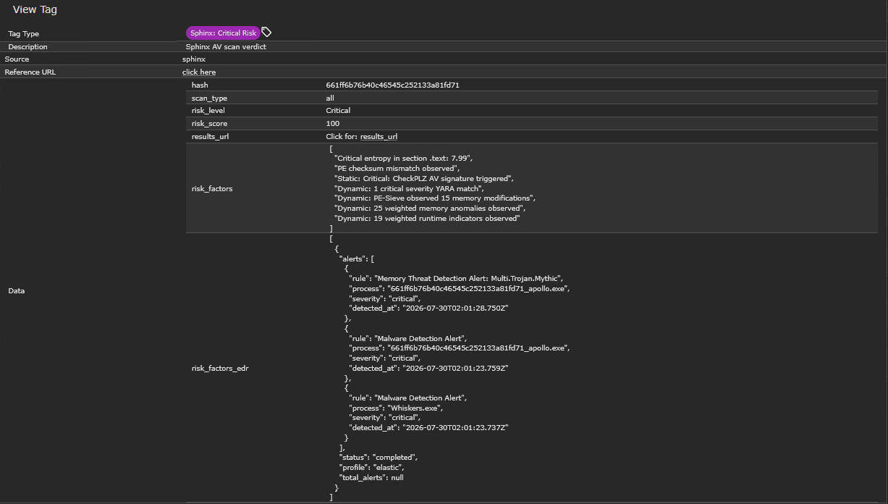

# Sphinx

A [LitterBox](https://github.com/BlackSnufkin/LitterBox) integration for the [Mythic](https://github.com/its-a-feature/Mythic) Command and Control framework.

Sphinx is a Mythic **eventing container**. Every time a payload finishes building, Sphinx fetches it, submits it to a self-hosted LitterBox sandbox for AV/detection analysis, and tags the payload in Mythic with the verdict - so you know whether a payload is clean or burned before you ever deploy it.

> **Lab use only.** Sphinx is a red-team automation tool. LitterBox has no authentication and is designed for isolated analyst networks - never expose it (or this workflow) to untrusted networks.

## How it works

```
Payload build completes
        │
        ▼
Mythic eventing workflow fires ──► Sphinx (execute_script)
        │
        ├─ 1. Resolve payload UUID → Mythic GraphQL → file id
        ├─ 2. Download payload bytes from Mythic
        ├─ 3. POST bytes to LitterBox /upload → MD5
        ├─ 4. Trigger scan(s): static / dynamic / holygrail / edr
        ├─ 5. Poll results until terminal state
        ├─ 6. Map LitterBox risk_level → verdict label
        └─ 7. Tag the payload in Mythic (verdict + full risk data)
```

### Verdict tags

| LitterBox risk level | Mythic tag | Color |
|---|---|---|
| `low` | `Sphinx: Clean` | green |
| `medium` | `Sphinx: Medium Risk` | orange |
| `high` | `Sphinx: High Risk` | red |
| `critical` | `Sphinx: Critical Risk` | purple |

The tag's `data` field carries: `risk_score`, `risk_level`, `risk_factors`, `risk_factors_edr` (EDR detection alerts, when applicable), `hash`, `scan_type`, and a `results_url` link back to the LitterBox report.



## Requirements

- A running Mythic server (with `mythic-cli`)
- A reachable LitterBox instance (default port `1337`)
- A Mythic API token (Settings → API Tokens)

## Install

From your Mythic server directory:

```bash
# Install from a local clone
./mythic-cli install folder /path/to/Sphinx

# ...or from GitHub
./mythic-cli install github https://github.com/hunterino-sec/Sphinx

# Start the container
./mythic-cli start sphinx
```

Before installing, set the RabbitMQ password in `Payload_Type/sphinx/rabbitmq_config.json` to match your Mythic `.env` (`RABBITMQ_PASSWORD`).

Confirm the container shows up under **Settings → Services** in the Mythic UI.

## Configure the eventing workflow

In the Mythic UI go to **Eventing → New Workflow**. Below are two example workflows - one automatic (fires on every payload build) and one manual.

### Automatic - scan on payload build

```yaml
name: Sphinx LitterBox Scan
description: Submit new payloads to LitterBox for analysis and tag with verdict
trigger: payload_build_finish
trigger_data:
    payload_types: []
environment:
    LITTERBOX_URL: http://<litterbox-ip>:1337
    SCAN_TYPE: all
    TIMEOUT: "120"
keywords:
    - sphinx
    - litterbox
run_as: bot
```

### Manual - scan a specific payload

```yaml
name: Sphinx Manual Scan
description: Manually scan a payload with LitterBox
trigger: manual
trigger_data: {}
environment:
    LITTERBOX_URL: http://<litterbox-ip>:1337
    PAYLOAD_UUID: d5c725bf-495b-4b6f-ad7f-065fa9276696
    SCAN_TYPE: static
    TIMEOUT: "120"
keywords:
    - sphinx
run_as: bot
```

Replace `LITTERBOX_URL` with your LitterBox instance address. `SCAN_TYPE` can be `static`, `dynamic`, `both`, `holygrail`, `edr`, or `all`.

Save and **enable** the workflow.

## Scan types

| Type | Behavior |
|---|---|
| `static` | YARA / PE / string analysis. Fast, effectively synchronous. |
| `dynamic` | Behavioral + memory analysis. Polled until `completed` / `blocked_by_av`. |
| `both` | Runs static and dynamic concurrently. |
| `holygrail` | Combined deep analysis (static + dynamic in one pass). Synchronous. |
| `edr` | Detonates the payload on an EDR-monitored VM and collects detection alerts. Requires an `edr_profile` input (or auto-discovers available profiles). Polled until complete. |
| `all` | Runs static, dynamic, and EDR concurrently. |

## Test

Build any payload in Mythic. Within ~30s (static) the payload should gain a `Sphinx: …` tag - view it under **Payloads → (payload) → Tags**. The tag data field links back to the full LitterBox report.

## Project layout

```
config.json                          Mythic container registration
documentation-wrapper/               placeholder (required by mythic-cli)
Payload_Type/sphinx/
  Dockerfile                         Alpine Python 3.11, multi-stage
  main.py                            container entry point
  rabbitmq_config.json               broker config
  .docker/requirements.txt           mythic-container, mythic, httpx
  sphinx/
    __init__.py
    eventing.py                      SphinxEventing - core logic
```

## Credits

- [Mythic](https://github.com/its-a-feature/Mythic) by @its-a-feature
- [LitterBox](https://github.com/BlackSnufkin/LitterBox) by @BlackSnufkin
- Structure modeled on [Hydra](https://github.com/MythicAgents/hydra)
